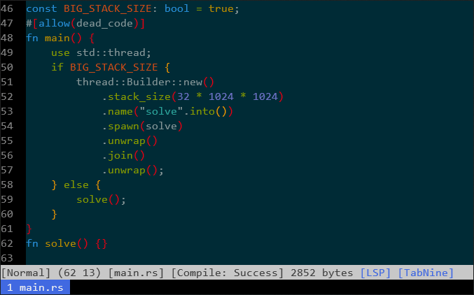

Accepted
===

[](https://crates.io/crates/accepted)
[](https://travis-ci.org/hatoo/Accepted)
[](https://gitter.im/Accepted-text-editor/community?utm_source=badge&utm_medium=badge&utm_campaign=pr-badge&utm_content=badge)
[](https://github.com/hatoo/Accepted)

A terminal text editor to be **ACCEPTED**.



## Description

A modal text editor for competitive programmer written with Rust.

Currently Accepted supports Rust and C++.

### Features

* Preconfigured for Rust and C++
* Autoformat with [Rustfmt](https://github.com/rust-lang-nursery/rustfmt) / [ClangFormat](https://clang.llvm.org/docs/ClangFormat.html) / or specify with configuration
* Completion with [RLS](https://github.com/rust-lang-nursery/rls) / [Clangd](https://clang.llvm.org/extra/clangd.html) / or Other LSP servers
* Auto compile and show compiler messages (Supports rustc / gcc / clang)
* Easy to test a single a code
* VScode style snippet support
* Mouse support
* rmate protocol

## Install

You need nightly Rust.

```bash
$ cargo install accepted
```

If you want to install `HEAD` version, you can install from git to

```bash
$ cargo install -f --git=https://github.com/hatoo/Accepted
```

### For Rust users

Install rust components.

```
$ rustup component add rls-preview
$ rustup component add rust-src
$ rustup component add rustfmt-preview
```

### For C++ users

Install clang, clang-format and clangd.

# Usage

```
$ acc [file]
```

TODO: More precisely.

## Basic

Many commands of `acc` is same as Vim.

i, I, a, A, o, O to insert mode and Esc to return.

hjkl, w, e, b to move cursor.

y, d, c, v, V works like vim

## Space Prefix

Some of commands can run with space as a prefix.

SPACE -> q to Quit.

SPACE -> s to Save.

SPACE -> a to Save As.

SPACE -> y to Copy all to clipboard

SPACE -> SPACE to Rustfmt.

SPACE -> t to compile and run with clipboard input.

SPACE -> T to compile (optimized) and run with clipboard input.

SPACE -> q to Quit.

SPACE -> r to Start rmate server

## Configuration

You can configure this by toml file placed in `[config_dir]/acc/config.toml`

`config_dir` is defined in [here](https://docs.rs/dirs/1.0.3/dirs/fn.config_dir.html).

Below is default configure.
You can override with your own configure.

```TOML
# Configure to defaults
[file_default]
indent_width = 4
# Set true if you are running in legacy terminal which has no true color
ansi_color = false

# Configure for *.rs files
[file.rs]
# Setting compiler and its type.
compiler = { command=["rustc", "$FilePath$", "-Z", "unstable-options", "--error-format=json"], type="rustc", optimize_option=["-O"] }
# Setting LSP server command
lsp = ["rls"]
# Setting formatter command
formatter = ["rustfmt"]

[file.cpp]
# Configure for *.cpp files
# Respect clang-format
indent_width = 2
compiler = { command=["clang", "$FilePath$", "-o", "$FileStem$"], type="gcc", optimize_option=["-O2"] }
lsp = ["clangd"]
formatter = ["clang-format"]
```

### Snippet Support

This supports vscode style snippet.

You can specify snippet files in configure

```toml
# On *.rs files
[file.rs]
# Use a snippet in this path
snippets=["~.config/acc/snippet.json"]
```

## Contribution

Any kind of contribution including feature request is welcome!!